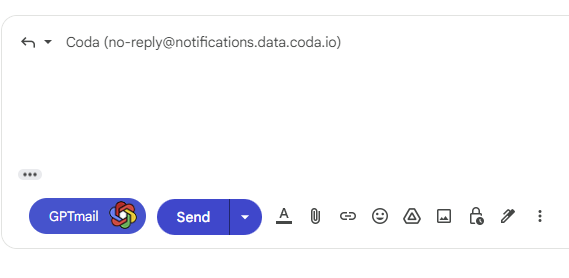
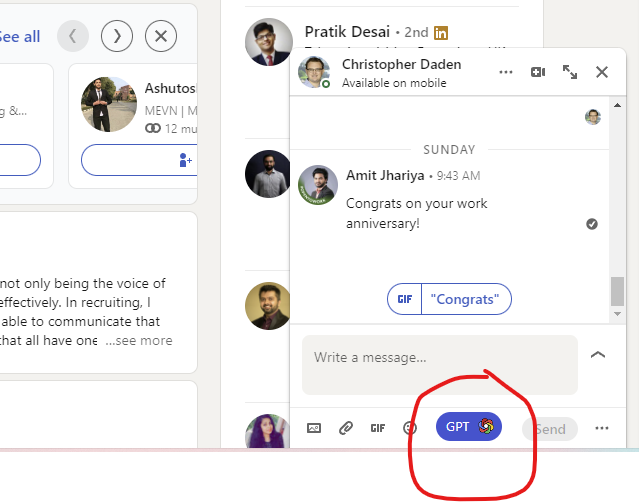

# GPTMail  Extension

GPTMail Gmail Extension is a browser extension that allows you to reply to Gmail messages using OpenAI's chatbot technology. With this extension, you can quickly and easily respond to your email messages with the help of advanced natural language processing. 

## Features

- Reply to Gmail messages using with signle Click
- Open source project that welcomes contributions from the community

## Prequisites
 1.Register for OpenAi account if not and get Your OPEN AI keys from your account page https://platform.openai.com/account/api-keys

## Installation

To install GPTMail Extension, follow these steps:

1. Clone the repository or download the ZIP file.
2. Open Google Chrome and navigate to the Extensions settings.
3. Enable Developer Mode.
4. Click the "Load unpacked" button and select the extension's directory.
5. provide OPEN API Keys and Signature When Extenstion will open a Extenstion Option new tab  

## Usage

After installation, GPTMail Extension will be available in your Gmail  and LinkedIn Pages. 
Whenever you click on Mail replay button GPTMail button will apear just before Send Button

Click GPTMail button to get ,it will write a mail for you using openai api.
Opening a message in LinkedIn at bootom GPT button will be available 

## Contributing

If you'd like to contribute to GPTGmail Extension, feel free to fork the repository and submit a pull request.

## License

ChatGPT Gmail Extension is licensed under the [MIT License].
